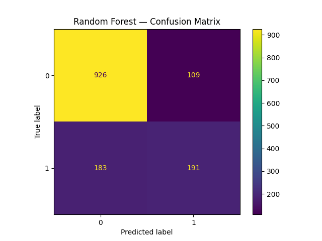

# Customer Churn Prediction

## Business Problem
Subscription-based businesses lose revenue when customers cancel, and acquiring a new customer costs significantly more than retaining an existing one. This project identifies which customers are at risk of churning and what factors drive that risk, so a business can prioritize retention efforts before customers leave — rather than reacting after they're gone.

## Dataset
[Telco Customer Churn](https://www.kaggle.com/datasets/blastchar/telco-customer-churn) — 7,043 telecom customers, 21 features (contract type, tenure, services, charges), sourced from Kaggle.

## Approach
1. **Data Cleaning** — fixed `TotalCharges` (blank strings on 0-tenure customers), dropped non-predictive ID column, encoded target variable.
2. **Exploratory Analysis** — examined churn rate by contract type, tenure, monthly charges, and service add-ons.
3. **Feature Engineering** — one-hot encoded categorical variables (contract type, internet service, payment method, etc.).
4. **Modeling** — trained and compared Logistic Regression and Random Forest classifiers.
5. **Evaluation** — compared models on ROC-AUC, precision, and recall (not just accuracy, since only 26.5% of customers churn).

## Key Findings
- **Contract length is the strongest churn predictor.** Month-to-month customers churn at 42.7%, vs. 11.3% (one-year) and 2.8% (two-year contracts).
- **Fiber optic customers are the highest-risk segment**, churning at ~42% — despite being a premium product, suggesting a service quality or pricing issue worth investigating.
- **Support add-ons cut churn substantially** — customers without Online Security or Tech Support churn at ~3x the rate of those with these add-ons.
- **Recommended action:** prioritize retention outreach on new, month-to-month, fiber-optic customers lacking security add-ons — the segment combining every major risk factor found.

## Model Performance
Logistic Regression outperformed Random Forest and was selected as the final model:

| Metric | Logistic Regression | Random Forest |
|---|---|---|
| ROC-AUC | 0.842 | 0.826 |
| Precision (churn) | 0.66 | 0.64 |
| Recall (churn) | 0.56 | 0.51 |

The model correctly ranks churn risk with strong reliability (0.842 ROC-AUC) and catches 56% of actual churners with 66% precision on flagged customers — accurate enough to meaningfully prioritize a retention team's outreach list.

## Limitations & Future Improvements
- Recall of 56% means roughly 44% of churners are missed — could be improved with additional features (e.g. customer support interaction history, usage trends over time) not present in this dataset.
- Model was trained on a single snapshot in time; a production version would need retraining on fresh data periodically.
- Class imbalance (26.5% churn) could be addressed further with techniques like SMOTE in a future iteration.

## Tech Stack
Python, Pandas, Scikit-learn, Seaborn/Matplotlib, Google Colab

## How to Run
1. Open `notebook/churn_analysis.ipynb` in Google Colab
2. Add your own Kaggle API token (see notebook Step 4)
3. Run all cells top to bottom
